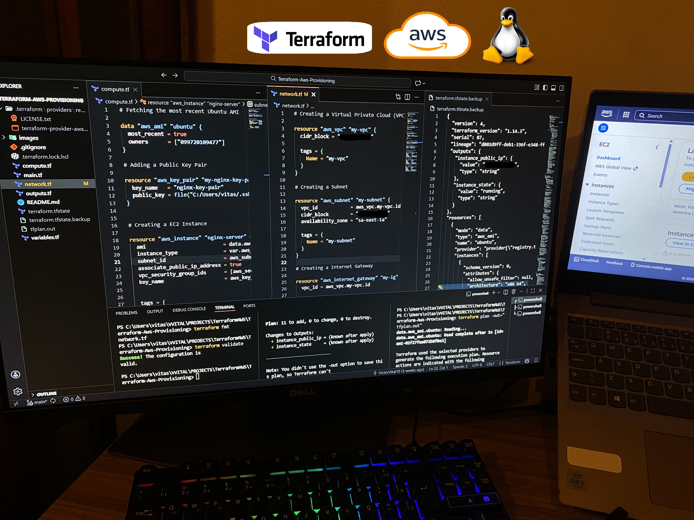
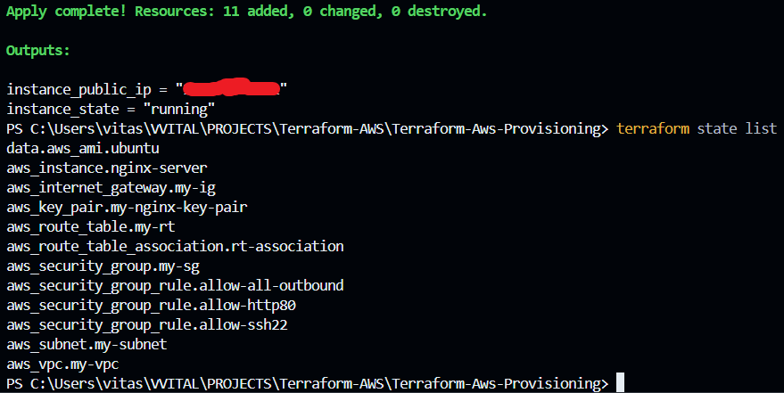
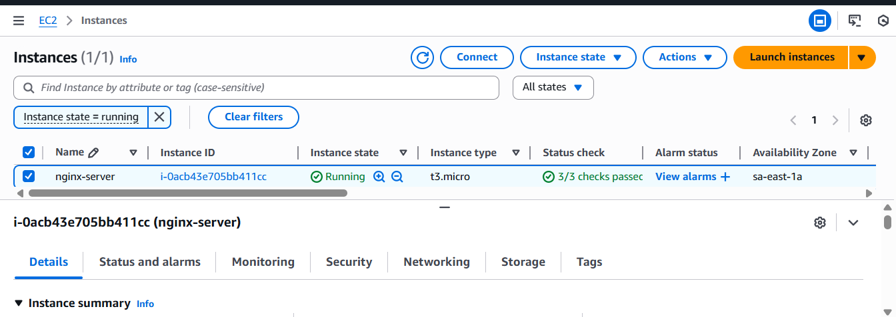
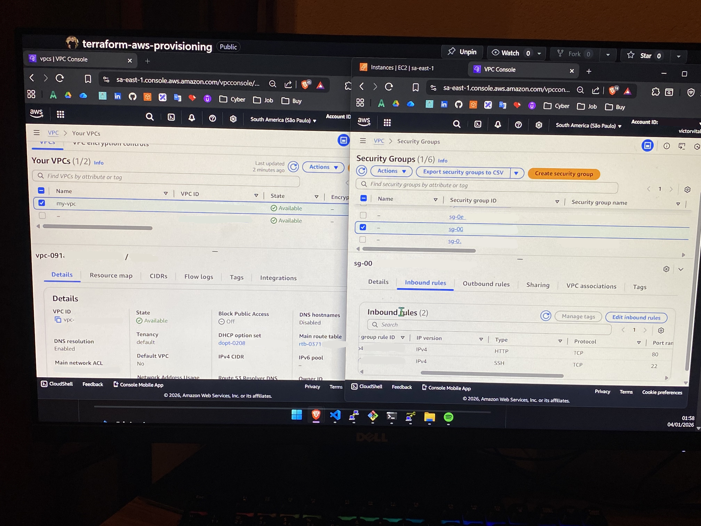
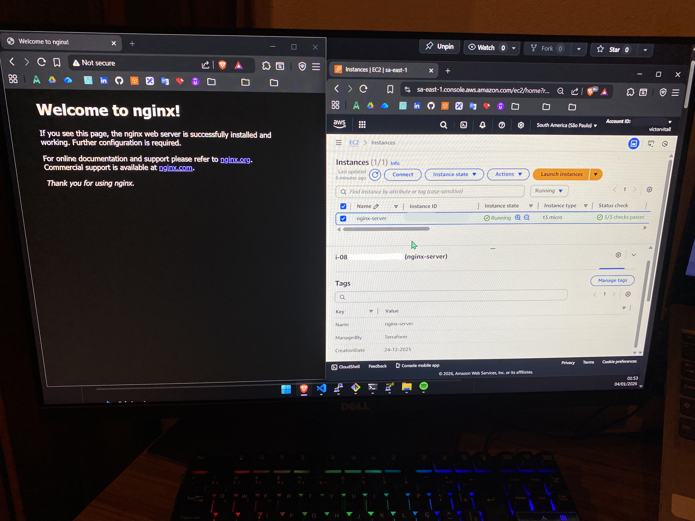
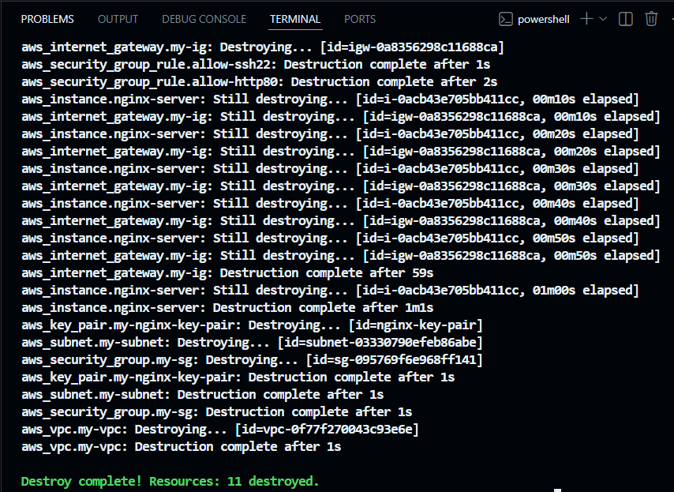

## 🚀 Terraform AWS Provisioning - Infraestrutura como Código para provisionamento automatizado na **AWS** utilizando **Terraform**

Projeto desenvolvido para aplicar, na prática, **Terraform, AWS, Linux e Git** na automação e versionamento de uma infraestrutura funcional.

---

## 🎯 Objetivo

A **ideia** é demonstrar, de forma clara e organizada, como criar uma infraestrutura funcional na AWS usando Terraform, evitando tarefas manuais e repetitivas no console.

Cada recurso é descrito como código, versionado com Git e fácil de reproduzir em qualquer ambiente.

---

## 🧱 Recursos Provisionados

Atualmente, o projeto conta com o provisionamento dos seguintes componentes:

- **VPC** – Rede virtual na nuvem.
- **Subnets** – Organização da rede.
- **Security Groups** – Regras de acesso.
- **Instância EC2** – Máquina virtual Linux.
- **Key Pair** – Acesso SSH.
- **Servidor web Nginx** – Instalado automaticamente na instância.

Todos esses **recursos** foram provisionados de forma automatizada com trechos de código e comandos **Terraform**.

---

## 📂 Estrutura dos Arquivos

- **main.tf** – Configurações principais do Terraform.
- **network.tf** – Recursos de rede (VPC, Subnets, SG).
- **compute.tf** – Recursos de computação (EC2, Key Pair).
- **variables.tf** – Declaração de variáveis.
- **outputs.tf** – Informações exibidas após o deploy.
- **.gitignore** – Arquivos que não devem ser **rastreados** pelo Git. 

A separação dos arquivos segue uma prática clássica e eficiente, facilitando a manutenção e leitura do código.

---

## 📘 Processo

1. Criação da conta na AWS.
2. Criação de um usuário IAM dedicado para uso do Terraform.
3. Instalação e configuração da AWS CLI.
4. Configuração das credenciais da AWS na máquina local.
5. Instalação do Terraform.
6. Estruturação dos arquivos e diretórios do projeto.
7. Inicialização do Terraform (`terraform init`).
8. Criação da infraestrutura como código, seguindo a documentação oficial do Terraform e da AWS.
9. Formatação e validação do código (`terraform fmt` e `terraform validate`).
10. Revisão do plano de execução (`terraform plan`).
11. Provisionamento da infraestrutura na AWS (`terraform apply`).
12. Verificação dos recursos criados diretamente no console da AWS.
13. Versionamento e armazenamento do código utilizando Git e GitHub.

> ⚠️ **IMPORTANTE**
> - Evite modificar ou excluir recursos manualmente na AWS.  
> - Alterações manuais no console podem desatualizar o arquivo **state**, que tem a função de manter o mapeamento entre a infraestrutura real e o código.  
> - Para manter o arquivo **state** consistente, utilize `terraform destroy` quando precisar remover a infraestrutura.

---

## 🖼️ Demonstração

#### Organização dos arquivos e diretórios e saída do comando `terraform plan -out="tfplan.out"`, mostrando o plano de ação criado pelo próprio Terraform

---

#### Saída dos comandos `terraform apply` e `terraform state list`, mostrando quantos e quais recursos foram criados

---

#### Instância EC2 em execução

---

#### VPC e Security Group devidamente criados

---

#### Servidor web Nginx instalado na instância e acessível através do navegador

---

#### Saída do comando `terraform destroy`, mostrando quantos e quais recursos foram destruídos

---

## ⚡Tecnologias Utilizadas:

- **AWS** – Provedor de nuvem utilizado para provisionamento da infraestrutura.
- **Terraform** – Infraestrutura como Código (IaC).
- **Linux** – Sistema operacional da instância EC2.
- **Nginx** – Servidor web instalado na instância.
- **Git** – Controle de versão do projeto.
- **AWS CLI** – Interface para interação com a AWS via linha de comando.

---

## 📎 Link para o Post no LinkedIn

👉 [Acessar publicação]() 

---

## 👤 Autor

**Victor Araujo Vital**  

📌 LinkedIn: [https://www.linkedin.com/in/victorvitall/](https://www.linkedin.com/in/victorvitall/)

---